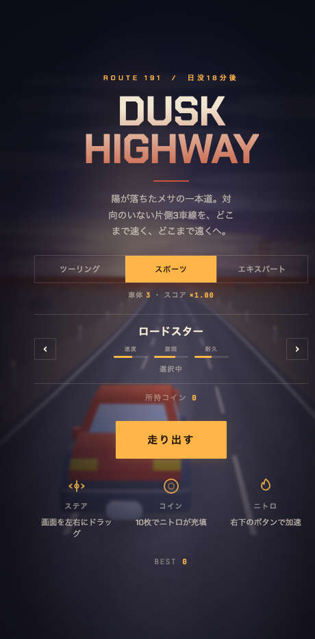
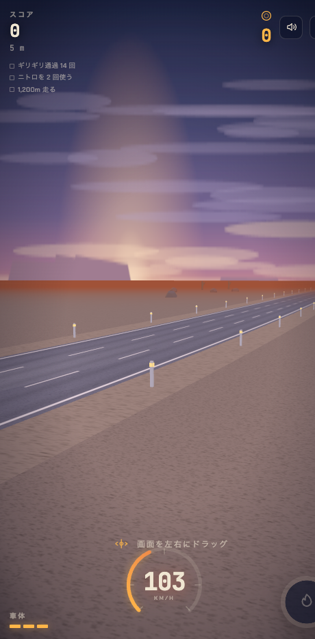

# Dusk Highway

日没後の砂漠ハイウェイを走る、スマホ向け3Dエンドレスレースゲーム。

| タイトル | 走行中 |
|---|---|
|  |  |

| 項目 | 内容 |
|---|---|
| 状態 | Web版 完成 |
| Web公開 | https://kiyotake1229.github.io/dusk-highway/ （GitHub Pages） |
| 開発確認用 | https://claude.ai/code/artifact/4359209e-6e11-46da-9140-03e8ec24c97d （Claude Artifact） |
| 本体 | `index.html`（約1.9MB。3Dモデルを内包） |
| 技術 | Three.js r128 |
| 通信 | なし（完全オフライン） |
| データ | 端末内のみ（ハイスコア・所持コイン・解放した車） |
| PWA | 対応（`manifest.json` / `sw.js` / アイコン一式） |
| iOS | 未着手 |

---

## 社内説明資料

岩崎さんに説明するときの資料一式は `資料/` にある（開発ドキュメントとは別）。

| 資料 | 場所 |
|---|---|
| スライド（Claude Design。閲覧・修正・PDF書き出し） | https://claude.ai/code/artifact/913a5070-4d04-4c8f-916f-378fbe4a8695 |
| スライド（PDF） | `資料/プレゼン資料/DuskHighway_社内説明.pdf` |
| 話す台本 | [資料/プレゼンの進め方.md](資料/プレゼンの進め方.md) |
| スライドの生成元 | `資料/プレゼン資料/gen.py`（文言を直して `python3 資料/プレゼン資料/gen.py`） |

## 開発ドキュメント

開発の記録は `docs/` で管理している。命名規則・連番のルールは [docs/README.md](docs/README.md)。

- 現状の仕様と構成（最初の1本）: [docs/20260915_DOC_0001_ALL_現状の仕様と構成.md](docs/20260915_DOC_0001_ALL_現状の仕様と構成.md)
- 機能追加・バグ修正・改善をしたら、1件ごとに文書を足して `bash docs/manager/generate_docs_json.sh` を実行する（一覧: `docs/manager/docs.json`）

---

## 遊び方

- 画面を左右にドラッグしてステアリング（PCは矢印キー）
- 対向車・パイロンを避け、コインを集める
- コイン10枚でニトロが充填。右下のボタンで加速
- 車体は難易度と車種で決まる。0になると終了

## 主な仕様

- **難易度3段階** — ツーリング / スポーツ / エキスパート。障害物の密度・速度・車体数・スコア倍率が変わる。ハイスコアは難易度ごとに記録
- **時間帯の変化** — 1,300mごとに 日没 → 薄暮 → 深夜 → 夜明け と移り変わる
- **スコアとコンボ** — コイン取得・ギリギリ通過でコンボが最大×8まで上昇
- **ミッション** — 毎回3つ提示。達成で+1,500点
- **車種** — コインを貯めて6車種を解放。速度・旋回・耐久が異なる
- **ギミック** — 加速板、ジャンプ台、修理キット

## 素材

3Dモデルは **Kenney Car Kit 3.1**（CC0 / 商用可 / クレジット不要）。
ライセンス全文は `models/KENNEY-LICENSE.txt`。

モデルの差し替え手順は [MODELS.md](MODELS.md) を参照。

---

## 技術的な注意

**Claude Artifact で公開する場合、テクスチャは data URI で持たせること。**

glb のバイナリにテクスチャを内包すると blob URL 経由になり、Artifact の CSP で `fetch` が遮断されて読み込みに失敗する（モデルが表示されず、内蔵のコード生成モデルにフォールバックする）。

対策は2つ重ねてある:

1. モデル解析中だけ `window.createImageBitmap` を隠し、ImageBitmapLoader ではなく通常の TextureLoader を使わせる
2. テクスチャは glb に内包せず data URI で持ち、`THREE.DefaultLoadingManager.setURLModifier()` で差し替える

---

## 開発用のコンソールAPI

ブラウザのコンソールから呼べる。製品動作には影響しない。

| 関数 | 用途 |
|---|---|
| `__sim(秒)` | 画面が止まっていても内部時間を進める |
| `__audit(秒)` | 走らせながら「3車線すべて塞がった帯」が出ないか監査する |
| `__put('ramp'\|'pad'\|'kit'\|'cone', 距離, 車線)` | 目の前に障害物を出して見た目を確認する |
| `previewCars()` | 全車種を並べて回転表示する |

---

## ファイル構成

```
3Dスマホゲーム/
  index.html            アプリ本体（3Dモデル・テクスチャを内包）
  manifest.json / sw.js PWA用
  icon-1024.png         iOSアプリ化時の元アイコン
  icon-192.png / icon-512.png / apple-touch-icon.png
  models/               3Dモデル（Kenney Car Kit）とライセンス
  tools/embed-glb.mjs   モデルを index.html に埋め込むツール
  tools/icon-gen.html   アイコンの生成元（Canvas描画。Chromeヘッドレスで撮影）
  screenshots/          README用の画面
```

## 残作業

iOS化する場合に必要なもの:

- `ios-app/` の構築（`habit/ios-app/` が雛形。アイコンは `icon-1024.png` を `assets/icon.png` に置く）
- 触覚フィードバックの Capacitor Haptics 化（現状は `navigator.vibrate`）
- 実機での動作検証 — **ファイルサイズが大きく初回読み込みに15〜20秒かかる**。起動画面は出るが、時間自体は変わらない
- 横持ちは manifest で縦固定にしてある。ブラウザで横にした場合はHUDを縮小して対応
